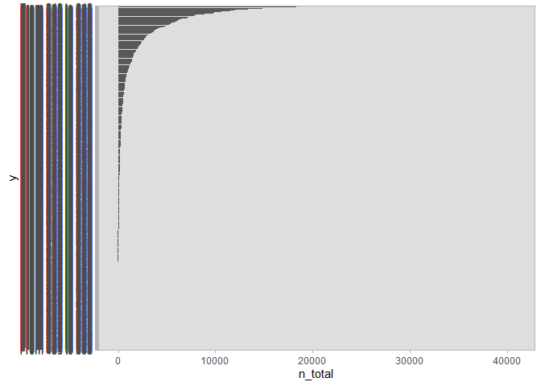

# Match geometry with room information

## Rooms (nodes)

We need to match ids from the geom rooms CSV and the nodes array.

In general, `f9_ap_rooms` uses `id_ap_3` to match rooms. It’s the only
CSV with information both with the id and the original Museum room
number.

`load rooms.csv` — This CSV was created scraping the SVG with Louvre’s
blueprint. To modify, check the
[blueprints](https://github.com/irenedelatorre/2022.02_Tokyo.University_Louvre/tree/blueprints)
branch.

    ## Rows: 443 Columns: 4
    ## -- Column specification --------------------------------------------------------
    ## Delimiter: ","
    ## chr (2): floor, room
    ## dbl (2): x, y
    ## 
    ## i Use `spec()` to retrieve the full column specification for this data.
    ## i Specify the column types or set `show_col_types = FALSE` to quiet this message.

We need to match it with `f9_ap_rooms`. To load the file run either:

**Load exported CSV**

    ## Rows: 255 Columns: 8
    ## -- Column specification --------------------------------------------------------
    ## Delimiter: ","
    ## chr (5): Area, Floor, Type, Collection, Highlight
    ## dbl (3): id_ap_3, Room_Number, Museum_room
    ## 
    ## i Use `spec()` to retrieve the full column specification for this data.
    ## i Specify the column types or set `show_col_types = FALSE` to quiet this message.

**Produce and export CSV again**

``` r
source("R/1_load_data")
source("R/2_merge_data.R")

## f6 = f3 + f4 ------ merge by mac id ----------------------------------------

source("R/3_match_f3_f4_to_f6.R")

f6_id_1_2_matched <- create_f6(
  f3 = f3_WiFi_rename_miyajima_200528fin,
  f4 = f4_WIFI_LOUVRE_TRUE
  )


## f8 = f5 + f6 ------ merge by id_ap_2 ----------------------------------------
# pick single names of the id_ap_2
source("R/4_match_f5_f6_to_f8.R")

f8_ap_matched_rooms <- create_f8(
  f5A_Louvre_MIT_1_2017_11,
  f5A_Louvre_MIT_1_2017_12,
  f5A_Louvre_MIT_1_2018,
  f6 = f6_id_1_2_matched,
  f12 = f12_room_names_ids
  )

## f9 = summary of 8 ----------------------------------------------------------
source("R/5_f8_to_summary_f9.R")
f9_ap_rooms <- create_f9(f8_ap_matched_rooms)
```

### Match data

``` r
rooms_geom <- rooms_geom %>%
  rename(Museum_room = room) %>%
  rename(floor_short = floor)

rooms <- merge(f9_ap_rooms, rooms_geom, by="Museum_room", all=T)
```

`rooms` is a data frame with:

-   Museum_room: real room number in the museum. Eg. 524
-   id_ap_3: wifi id. Eg 43
-   Room_number: a room number, not to be mistaken with Museum_room. Eg
    138
-   Area: area of the museum. Eg Richelieu
-   Floor: floor of the museum. Eg. RC - Level 0
-   Type: if it’s stairs. NA is a normal room
-   Collection: Decorative Arts
-   Highlight: a highlighted painting
-   floor: floor of the museum. Short version. EG RC
-   x: x position in the SVG
-   y: y position in the SVG

### Match with network information (nodes)

We will be drawing lines between the rooms. The `node` data frame is
created in `R/network_00.R`. Here, we will import the final result:

``` r
# source("../R/network_00.R", local = knitr::knit_global())

nodes <- read_csv("../output/network_nodes_agg_all.csv")
```

    ## Rows: 42 Columns: 6
    ## -- Column specification --------------------------------------------------------
    ## Delimiter: ","
    ## chr (1): date
    ## dbl (5): id_ap_3, n_total, total_duration_sec, mean, median
    ## 
    ## i Use `spec()` to retrieve the full column specification for this data.
    ## i Specify the column types or set `show_col_types = FALSE` to quiet this message.

``` r
rooms_nodes <- merge(rooms, nodes, by="id_ap_3", all=T) %>%
  select(!c("date", "total_duration_sec"))
```

`rooms_nodes` is a data frame with all the columns from `rooms` and :

-   n_total: total number of visitors
-   mean - mean duration of the visit, in seconds
-   median - median duration of the visit, in seconds

### Final filtering and export

We can only draw those rooms with X and Y positions (those that appear
in the blueprints of the museum). Therefore, we remove the rows with NAs
in the x column.

``` r
rooms_nodes <- rooms_nodes %>%
  drop_na(x)

write.csv(rooms_nodes, file = "../output/rooms_geom.csv", row.names = FALSE)

head(rooms_nodes)
```

    ##   id_ap_3 Museum_room Room_Number      Area         Floor Type
    ## 1      16         102         394 Richelieu S1 - Level -1 <NA>
    ## 2      20         132         407     Sully S1 - Level -1 <NA>
    ## 3      22         133         408     Sully S1 - Level -1 <NA>
    ## 4      24         134         412     Sully S1 - Level -1 <NA>
    ## 5      26         135         411     Sully S1 - Level -1 <NA>
    ## 6      28         186         416     Denon S2 - Level -2 <NA>
    ##              Collection Highlight floor_short    x     y n_total mean median
    ## 1            Sculptures      <NA>          S1  655 162.5   33094  281    179
    ## 2 History of the Louvre      <NA>          S1 1147 418.5  145087  208    158
    ## 3 History of the Louvre      <NA>          S1 1257 418.5   81896  128     88
    ## 4 History of the Louvre      <NA>          S1 1335 488.5   42108  228    161
    ## 5 History of the Louvre      <NA>          S1 1257 486.5   19263  234    216
    ## 6                  <NA>      <NA>          S2  850 661.5   31340  275    191

## Match geometry with links

We will be drawing lines between the rooms. We need to provide the x and
y information from the SVG to the links dataframe.

`links` is created through `R/network_00.R`.

``` r
# source("../R/network_00.R", local = knitr::knit_global())
```

You can also load the data by importing the exported data frame:

``` r
links <- read_csv("../output/network_agg_all.csv")
```

    ## New names:
    ## Rows: 1803 Columns: 8
    ## -- Column specification
    ## -------------------------------------------------------- Delimiter: "," chr
    ## (1): date dbl (7): ...1, source, target, n_total, total_duration_sec, mean,
    ## median
    ## i Use `spec()` to retrieve the full column specification for this data. i
    ## Specify the column types or set `show_col_types = FALSE` to quiet this message.
    ## * `` -> `...1`

This dataframe doesn’t include the Museum room, but it has `source` and
`target` as id_ap_3. If we match `links` with `rooms` we can get all the
information we need.

The difficulty is that we have several wifipoints with the same id in
more than one room.

``` r
matchLinks <- function(id, param) {
  
  this_room <- rooms %>%
    filter(id_ap_3 == id) %>%
    drop_na("Museum_room") %>%
    filter(Museum_room != "NA")
  
  if (nrow(this_room) == 1) {
    return (this_room[, `param`])
  } else if (nrow(this_room) == 0) {
    return (NA)
  } else if (nrow(this_room) == 2) {
    return (this_room[1, `param`])
  } else if ((nrow(this_room) %% 2) == 0) {
    mid <- nrow(this_room) / 2
    return (this_room[mid, `param`])
  } else if ((nrow(this_room) %% 2) != 0) {
    mid <- 0.5 + nrow(this_room) / 2
    return (this_room[mid, `param`])
  }
}


links_rooms <- links %>% 
  rowwise() %>%
  mutate(
    source_x = matchLinks(source, "x"),
    source_y = matchLinks(source, "y"),
    target_x = matchLinks(target, "x"),
    target_y = matchLinks(target, "y"),
    source_museum_room = matchLinks(source, "Museum_room"),
    target_museum_room = matchLinks(target, "Museum_room"),
  ) %>%
  select(!c("date", "total_duration_sec"), "mean", "median", "...1")

head(links_rooms)
```

    ## # A tibble: 6 x 12
    ## # Rowwise: 
    ##    ...1 source target n_total  mean median source_x source_y target_x target_y
    ##   <dbl>  <dbl>  <dbl>   <dbl> <dbl>  <dbl>    <dbl>    <dbl>    <dbl>    <dbl>
    ## 1     1      1      1   45192   229    153       NA       NA       NA      NA 
    ## 2     2      1     16    1193   209    167       NA       NA      655     162.
    ## 3     3      1     20   12478   193    143       NA       NA     1147     418.
    ## 4     4      1     21    1236   195    148       NA       NA       NA      NA 
    ## 5     5      1     22     789   202    172       NA       NA     1257     418.
    ## 6     6      1     24     378   218    172       NA       NA     1335     488.
    ## # ... with 2 more variables: source_museum_room <chr>, target_museum_room <chr>

This dataset has:

-   source, start room using `id_ap_3`
-   target, end room using `id_ap_3`
-   source_x, x position of the source room, using information from the
    SVG
-   source_y, y position of the source room, using information from the
    SVG
-   target_x, x position of the source room, using information from the
    SVG
-   target_y, y position of the source room, using information from the
    SVG
-   n_total, total number of visitors who did this specific route
-   mean, mean duration of the visit, in seconds
-   median, median duration of the visit, in seconds
-   source_museum_room, actual room number of the starting point
-   target_museum_room, actual room number of the ending point

We can only use those links with x and y positions. Let’s filter them.

``` r
filtered_links <- links_rooms %>%
  drop_na(source_x) %>%
  drop_na(target_x)

write.csv(filtered_links, file = "../output/links_geom.csv", row.names = FALSE)

write.csv(
  links_rooms,
  file = "../output/links_geom_non_filtered.csv",
  row.names = FALSE
  )
```

### Summary of results

``` r
library("ggplot2")
```

    ## Warning: package 'ggplot2' was built under R version 4.1.3

``` r
ggplot(
  filtered_links %>%
    mutate(
      y = reorder(
        paste("From", source_museum_room, "to", target_museum_room),
        n_total)
      ),
  aes(
    x = n_total,
    y = y)) +
  geom_bar(stat='identity') + 
  theme_light()
```


